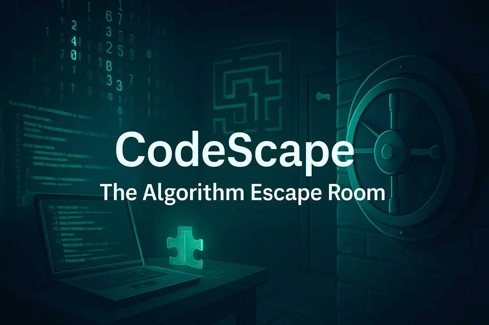

# CodeScape: The Algorithm Escape Room



## 🎯 Project Overview

CodeScape is an immersive, interactive web experience that combines computer science education with adventure gaming. This project presents a virtual algorithm escape room where teams collaborate to solve coding-inspired puzzles, crack digital codes, and navigate through challenges based on real CS concepts including recursion, encryption, sorting algorithms, and data structures.

The website serves as both an information hub and registration platform for this unique educational event, featuring a modern, cyberpunk-inspired design with neon aesthetics and dynamic interactive elements.

**Key Features:**
- 🎮 Interactive escape room concept presentation
- 🌙 Dark/Light mode toggle functionality
- 📝 Real-time RSVP system with participant tracking
- 📱 Responsive design with modern UI/UX
- ✨ Dynamic modals and success animations
- 🎨 Neon-themed visual effects and smooth transitions

## 📚 Background

This project was developed as part of the **CodePath WEB101 Intro to Web Development** course, serving as a comprehensive demonstration of fundamental web development skills including HTML5, CSS3, and vanilla JavaScript. The project spans multiple units of learning, incorporating progressive features from basic styling to advanced interactive functionality.

## 🔧 Implementation Details

### Core Components

#### **HTML Structure (`index.html`)**
- Semantic HTML5 markup with proper accessibility considerations
- Responsive navigation bar with smooth scroll anchoring
- Modal systems for user registration and success feedback
- Image-rich content sections showcasing the event experience
- Form validation and user interaction elements

#### **Styling (`styles.css`)**
- **CSS Variables**: Custom color scheme with cyberpunk/neon theme
- **Flexbox Layouts**: Modern responsive design patterns
- **CSS Animations**: Smooth transitions, hover effects, and keyframe animations
- **Dark/Light Mode**: Complete theme switching with seamless transitions
- **Mobile-First Design**: Responsive breakpoints and adaptive layouts

#### **JavaScript Functionality (`index.js`)**
- **Theme Toggle**: Dynamic dark/light mode switching with localStorage persistence
- **Modal Management**: Advanced modal systems with overlay controls
- **Form Validation**: Real-time input validation with visual feedback
- **Dynamic Content**: Live participant list updates
- **Event Handling**: Comprehensive user interaction management

### Notable Achievements

1. **Advanced Modal System**: Dual-modal architecture supporting both inline and popup registration forms
2. **Real-time Validation**: Custom validation with visual feedback using CSS classes
3. **Responsive Navigation**: Mobile-friendly navbar with neon glow effects
4. **Animation Framework**: CSS keyframe animations with JavaScript triggers
5. **Accessibility Features**: Semantic HTML and keyboard navigation support

### Challenges Overcome

- **State Synchronization**: Managing participant data across multiple form instances
- **Theme Consistency**: Ensuring visual coherence across light/dark modes
- **Modal UX**: Creating intuitive modal interactions without external libraries
- **CSS Variables**: Implementing a scalable color system for theme switching

## 🎓 Learning Outcomes

Through developing CodeScape, I gained valuable experience in:

### **Technical Skills**
- **Modern CSS**: Flexbox, CSS Grid, custom properties, and advanced selectors
- **Vanilla JavaScript**: DOM manipulation, event handling, and modern ES6+ syntax
- **Responsive Design**: Mobile-first development and cross-device compatibility
- **UI/UX Principles**: User-centered design, accessibility, and visual hierarchy

### **Development Practices**
- **Code Organization**: Modular CSS architecture and semantic HTML structure
- **Progressive Enhancement**: Building features layer by layer
- **Cross-browser Testing**: Ensuring compatibility across different environments
- **Performance Optimization**: Efficient CSS and JavaScript implementation

### **Problem-Solving Skills**
- **Debugging Techniques**: Using browser DevTools for troubleshooting
- **User Experience Design**: Creating intuitive interactions and feedback systems
- **State Management**: Handling complex user interactions without frameworks

## 🚀 Future Development

### Planned Enhancements

#### **Phase 1: Backend Integration**
- **Database Integration**: Store participant data persistently
- **Email Notifications**: Automated confirmation emails for registrants
- **Admin Dashboard**: Event management and participant tracking
- **Authentication System**: User accounts and login functionality

#### **Phase 2: Interactive Features**
- **Live Chat**: Real-time communication for registered participants
- **Team Formation**: Automated team matching based on skill levels
- **Progress Tracking**: Individual and team progress visualization
- **Leaderboards**: Dynamic scoring and achievement systems

#### **Phase 3: Educational Content**
- **Practice Puzzles**: Mini-challenges for skill building
- **Tutorial System**: Interactive CS concept explanations
- **Resource Library**: Curated learning materials and documentation
- **Mentorship Program**: Connect participants with experienced developers

#### **Phase 4: Advanced Features**
- **Mobile App**: Native iOS/Android companion application
- **AR Integration**: Augmented reality puzzle elements
- **AI Assistance**: Intelligent hints and personalized difficulty adjustment
- **Integration APIs**: Connect with coding platforms and educational tools

## 💡 Project Rationale

### **Inspiration and Motivation**

The choice to create CodeScape stemmed from a passion for making computer science education more engaging and accessible. Traditional CS learning often involves abstract concepts that can be difficult to visualize and apply. By gamifying these concepts through an escape room experience, students can:

- **Experience CS Concepts**: Apply algorithms and data structures in practical, engaging scenarios
- **Develop Teamwork**: Collaborate on complex problems in a supportive environment
- **Build Confidence**: Solve challenging puzzles that reinforce learning outcomes
- **Connect Theory to Practice**: See real-world applications of academic concepts

### **Personal Goals**

This project aligns with my goal of becoming a developer who creates educational technology that makes learning more inclusive and enjoyable. The escape room format addresses different learning styles while maintaining the rigor necessary for CS education.

### **Target Impact**

CodeScape aims to:
- Reduce intimidation around computer science topics
- Increase engagement with algorithmic thinking
- Foster collaborative problem-solving skills
- Bridge the gap between theoretical knowledge and practical application

## 📈 Future Plans

### **Short-term Goals (Next 6 months)**
- **User Testing**: Conduct usability studies with target demographics
- **Content Expansion**: Develop additional puzzle categories and difficulty levels
- **Performance Optimization**: Implement advanced caching and loading strategies
- **Accessibility Audit**: Ensure WCAG 2.1 AA compliance

### **Medium-term Goals (6-12 months)**
- **Backend Development**: Build robust server-side infrastructure
- **Mobile Optimization**: Create dedicated mobile experience
- **Partnership Development**: Collaborate with educational institutions
- **Beta Launch**: Limited release to gather user feedback

### **Long-term Vision (1-2 years)**
- **Full Platform Launch**: Complete educational gaming platform
- **Curriculum Integration**: Develop teacher resources and lesson plans
- **Global Expansion**: Multi-language support and international partnerships
- **Advanced Analytics**: Learning outcome tracking and educational insights

## 🏃‍♂️ Running the Code

### **Prerequisites**
- Modern web browser (Chrome, Firefox, Safari, Edge)
- Text editor or IDE (VS Code recommended)
- Local development server (optional but recommended)

### **Setup Instructions**

1. **Clone or Download the Repository**
   ```bash
   # If using Git
   git clone [repository-url]
   
   # Or download and extract the ZIP file
   ```

2. **File Structure Verification**
   ```
   codescape/
   ├── index.html
   ├── styles.css
   ├── index.js
   ├── main.png
   ├── main2.png
   ├── chll.png
   ├── first.png
   ├── excited final chall.png
   ├── yay.png
   └── logo500.png
   ```

3. **Local Development Server (Recommended)**
   ```bash
   # Using Python 3
   python -m http.server 8000
   
   # Using Node.js (if http-server is installed)
   npx http-server
   
   # Using VS Code Live Server extension
   # Right-click index.html → "Open with Live Server"
   ```

4. **Direct Browser Opening**
   - Simply double-click `index.html` to open in your default browser
   - Note: Some features may not work correctly without a proper server

### **Testing Features**

1. **Dark/Light Mode Toggle**: Click the "Mode" button in the header
2. **Navigation**: Test smooth scrolling to different sections
3. **RSVP Registration**: 
   - Use the main form or click "JOIN NOW!" for the modal
   - Try invalid inputs to see validation in action
4. **Responsive Design**: Resize browser window to test mobile layout
5. **Modal Interactions**: Test opening/closing modals and outside-click behavior

## 🤝 Contributing

We welcome contributions from developers, designers, educators, and students! Here are ways you can help improve CodeScape:

### **Areas for Contribution**

#### **🎨 Frontend Development**
- UI/UX improvements and new design patterns
- Accessibility enhancements and ARIA implementation
- Performance optimizations and code refactoring
- Cross-browser compatibility testing

#### **🧩 Content Development**
- New puzzle concepts and challenge designs
- Educational content and CS concept explanations
- Multilingual translations and localization
- User documentation and tutorials

#### **🔧 Technical Improvements**
- Backend architecture and API development
- Database schema design and optimization
- Testing framework implementation
- DevOps and deployment automation

#### **📊 Research and Analysis**
- User experience research and usability testing
- Educational effectiveness studies
- Accessibility audits and compliance testing
- Performance benchmarking and optimization

### **Contribution Process**

1. **Fork the Repository**: Create your own copy of the project
2. **Create Feature Branch**: `git checkout -b feature/your-feature-name`
3. **Make Changes**: Implement your improvements with clear, documented code
4. **Test Thoroughly**: Ensure all features work across different browsers/devices
5. **Submit Pull Request**: Include detailed description of changes and rationale

### **Code Standards**

- **HTML**: Use semantic elements and maintain accessibility
- **CSS**: Follow BEM methodology and maintain the existing variable system
- **JavaScript**: Use modern ES6+ syntax with clear, commented code
- **Documentation**: Update README and inline comments for any new features

## 🎉 Acknowledgments

### **Educational Resources**
- **CodePath**: For providing structured web development curriculum and mentorship
- **MDN Web Docs**: Comprehensive reference for web technologies
- **CSS-Tricks**: Inspiration for advanced CSS techniques and layouts

### **Design Inspiration**
- **Cyberpunk Aesthetics**: Modern gaming and sci-fi visual culture
- **Educational Gaming**: Platforms like CodeCombat and HackerRank
- **Escape Room Experiences**: Real-world puzzle and adventure game design

### **Tools and Technologies**
- **Visual Studio Code**: Primary development environment
- **Chrome DevTools**: Testing and debugging platform
- **GitHub**: Version control and collaboration platform

## 📄 License

This project is licensed under the MIT License - see the [LICENSE.md](LICENSE.md) file for details.

### **MIT License Summary**
- ✅ Commercial use permitted
- ✅ Modification and distribution allowed  
- ✅ Private use welcome
- ⚠️ No warranty provided
- 📝 License and copyright notice must be included

## 🛠️ Troubleshooting

### **Common Issues**

#### **Images Not Loading**
- Ensure all image files are in the same directory as HTML file
- Check file names match exactly (case-sensitive)
- Verify image file formats are supported (PNG, JPG, SVG)

#### **JavaScript Not Working**
- Open browser console (F12) to check for errors
- Ensure all files are served from the same domain/protocol
- Try hard refresh (Ctrl+F5) to clear cache

#### **Styles Not Applying**
- Verify CSS file path in HTML `<link>` tag
- Check for syntax errors in CSS file
- Ensure CSS custom properties are supported (modern browsers only)

#### **Modal Issues**
- Test JavaScript console for errors
- Verify event listeners are properly attached
- Check z-index conflicts with other elements

### **Browser Compatibility**

#### **Fully Supported**
- Chrome 60+
- Firefox 55+
- Safari 12+
- Edge 79+

#### **Limited Support**
- Internet Explorer: Not supported (CSS variables not available)
- Older mobile browsers: Basic functionality only

### **Performance Tips**
- Use local development server for optimal performance
- Enable browser caching for faster subsequent loads
- Consider image optimization for slower connections

---

**Built with ❤️ for CodePath WEB101** | **Developed by Sameeraa** | **© 2025 CodeScape. All rights reserved.**
